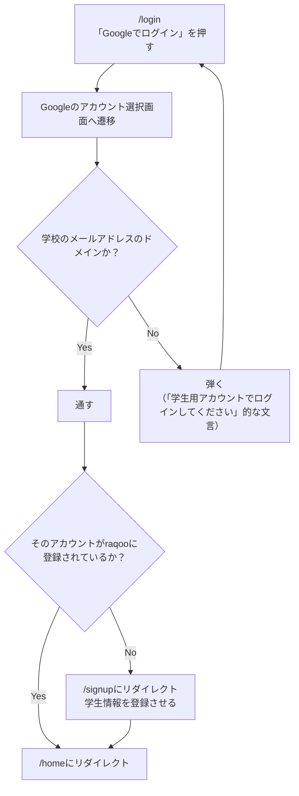

## Signup画面への遷移の仕方
サインアップにはドメインが
- @edu.sba.ac.jp
- @edu.ssm.ac.jp
- @sba.ac.jp
- @aam.ac.jp
ではないと弾く仕組みになっている
また、ログインやサインアップには「Googleでログイン」を行わないといけないようにする

```mermaid
flowchart TD
    A["/login<br>「Googleでログイン」を押す"] --> B[Googleのアカウント選択画面へ遷移]
    B --> C{学校のメールアドレスのドメインか？}
    C -- Yes --> D[通す]
    C -- No --> E["弾く<br>（「学生用アカウントでログインしてください」的な文言）"]
    E --> A
    D --> F{そのアカウントがraqooに登録されているか？}
    F -- Yes --> H["/homeにリダイレクト"]
    F -- No --> G["/signupにリダイレクト<br>学生情報を登録させる"]
    G --> H
```